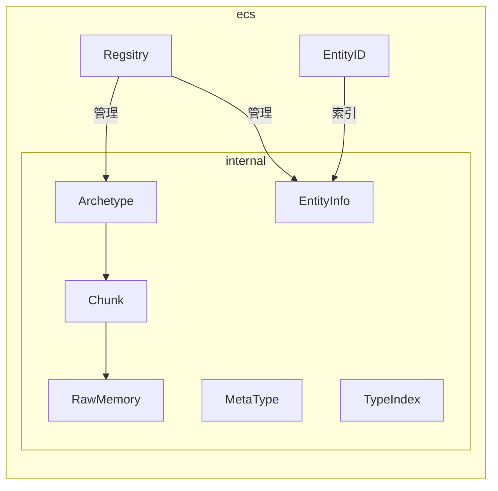

# 基于Archetype的ECS设计与实现
[草稿，建设中...]

&emsp;&emsp;ECS(Entity Component System)[^4]是近些年来游戏开发领域的热门词汇，这篇短文记录了实现一个玩具ECS的学习路程和思考。
<!-- more -->

## 简介
&emsp;&emsp; ECS是游戏开发中炙手可热的技术。近些年，商业引擎Unreal[^2]、Unity都提出了自己的ECS框架，O3DE号称是一个基于ECS的游戏引擎。看到如此神奇的编程方式，遂忍不住探索了一番。下文主要记录我在实现一个简单ECS过程中的思考。关于ECS的基本概念可以参考Entt作者的博客[^6], 当然也有知乎大佬的翻译版[^7]。

## 概念与实现要点

*If there a one, there are more.*

### 概念简述

&emsp;&emsp;ECS是一种游戏编程模式，主要的思路是数据与行为分离，在此基础上，连续存放数据数据，提高缓存命中率[^8]，从而加速游戏程序执行效率。更多的概念从博客[^6]上可以了解更多。

&emsp;&emsp;性能的优化是ECS的主打优点。首先是数据在内存上的排列，设计一种合适的组件内存排列格式来达到缓存命中率的目的，目前已经有用Archetype[^1][^2][^3]和稀疏表[^8]的实现案例。关于缓存命中率，上图非常直观展示OOP和DOP的区别。另一方面是行为的优化，所谓的"行为"即串行的逻辑，在游戏中即遍历GameObject的的行为操作，将串行的逻辑转变为并行的逻辑也是一个发展方向。

&emsp;&emsp;代码可维护性也是ECS的优势。ECS将数据与行为分离，提供了状态与改变状态的建模。状态机模式能够让代码结构简单。在名为“ECS”的状态机模型中，components即状态，逻辑是将Components状态的Transform。这种将行为定义为数据(Component)的转换的思路契合面向数据编程(DOP)的概念[^5]，它提供了良好的可调试性和可维护性。

&emsp;&emsp;ECS也存在一些问题，当然一部分来自于其本身的特性，一部分属于我自己的认知深度。比如ECS是一种机器友好的DOP编程模式，这意味着熟悉OOP的编程人员要学习拥抱变化（虽然一直在拥抱变化）。对我个人而言，游戏引擎中一大利器“消息模式”在ECS中如何实现是一个问题。

&emsp;&emsp;从实现角度上来说，这篇短文只记录了关于ECS数据内存排布的实现方式，关于如何利用多线程去加速“行为”目前暂未涉足。

### 要点
&emsp;&emsp; 下表列出了我认为相关的知识点，当然仅限用于实现一个简易的ECS模块。

|要点|子要点|
|--|--|
|裸内存|分配、回收、格式化读取、删除|
|ECS|Chunk、ArcheType、Registry|
|C++模版|函数模版，type_traits|

&emsp;&emsp; 当我第一次去看MASS[^2]的代码时，我不理解Archetype这层抽象的意义。没错，就算表达为“Entity的类”，也没有解决我的问题，更重要的是它为什么存在。

## 设计

&emsp;&emsp; 对于主打学习为目的的小框架，写代码的目的主要是为了让自己看懂和理解。网络上不乏优秀的ECS实现，比如主打一个简洁的UECS。为了若干月后还能看懂自己写的代码，在实现过程中没有吝啬代码行数。至于性能测试，暂时也没有做比较。所以，我定义自己的小框架是一个玩具级的实现。代码参考DECS[^1](为数不多我能理解的ECS实现)。

### 分层

&emsp;&emsp;在实现上，我的设想是尽量做好可见性和功能的层划分。

&emsp;&emsp;首先，关于接口“可见性”的分层，对于使用者而言。使用者要像使用sql一样简单，只需要知道检索条件就可以获取到一组合适的数据，至于内部数据怎么放的是开发者该关心的事情。实现这种思路，简单地在代码的命名空间增加了一个internal层级，意味仅内部使用, 也提醒在后续开发不要让使用者能使用或获取到internal命名空间的类和方法。

&emsp;&emsp;接着，是代码功能的分层。从下向上看，RawMemory只定义了关于纯内存块的定义，包括内存块的大小，内存数组如何访问等功能。Chunk在RawMemory之上定义了内存的“格式”，根据“格式”来读、写内存。在ECS中就是相同类型的Component在内存中连续排布，我们就可以在Chunk中定义一个个区间，每个区间存放相同类型的Component。在Archetype中负责将数据增删到chunk中，至于Registry也可以理解为ECS模块的门面。它提供ecs各种接口的，管理着不同类型的Archetype。

&emsp;&emsp;其他，还有一些辅助类。比如MetaType是Compnent的格式，对内提供Component的元信息；TypeIndex记录了每个Component的唯一ID，并用它来组成一个Bitmap，作为Archetype的唯一标识。

## 实验设置、结果

## 遇到过的问题
&emsp;&emsp;在一开始设计的时候，我不可避免地陷入到关于Archetype和Component的类型擦除问题上。涉及到模版总是有心无力。当我看到decs的实现，并联想到之前自己设计的内存PoolAllocator后，没错，类型就是一种格式，只需要在读(decode)和写(encode)的时候知道就可以了。至于存储它的容器的类型可以是unsigned char。

## 引用
[^1]: https://github.com/vblanco20-1/decs
[^2]: https://dev.epicgames.com/documentation/zh-cn/unreal-engine/overview-of-mass-gameplay-in-unreal-engine
[^3]: https://unity.com/cn/dots
[^4]: https://www.bilibili.com/video/BV1p4411k7N8/?vd_source=b7c2138ea8aa033f5b5f8039de77f0d4
[^5]: https://www.bilibili.com/video/BV1xW411r7tz/?spm_id_from=333.337.search-card.all.click&vd_source=b7c2138ea8aa033f5b5f8039de77f0d4
[^6]: https://skypjack.github.io/2019-02-14-ecs-baf-part-1/
[^7]: https://zhuanlan.zhihu.com/p/684268890
[^8]: https://github.com/skypjack/entt
[^9]: https://gameprogrammingpatterns.com/data-locality.html
[^10]: https://www.bilibili.com/video/BV13D4y1v7xx/?spm_id_from=333.337.search-card.all.click&vd_source=b7c2138ea8aa033f5b5f8039de77f0d4

