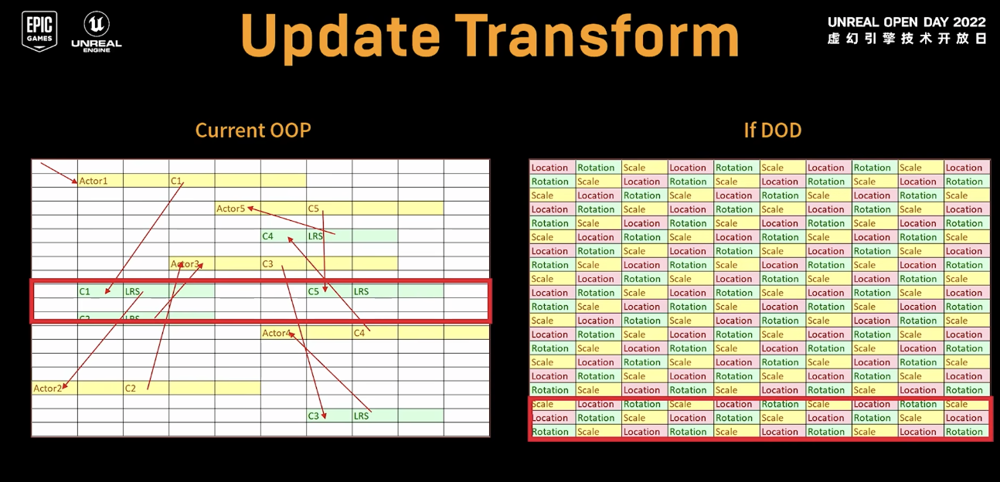
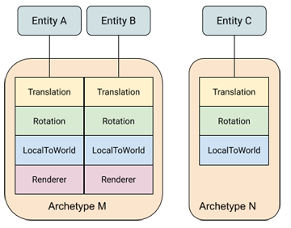
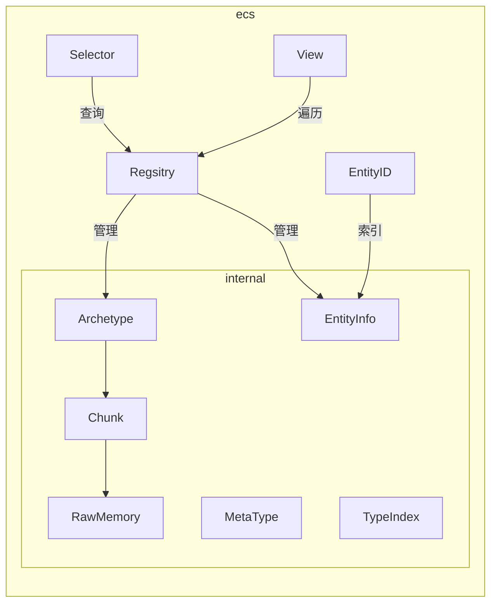
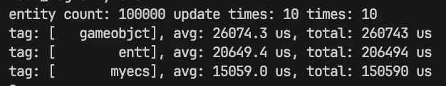

# 基于Archetype的ECS设计与实现

&emsp;&emsp;ECS(Entity Component System)[^4]是近些年来游戏开发领域的热门词汇，这篇短文记录了实现一个玩具ECS的学习路程和思考。
<!-- more -->

## 简介
&emsp;&emsp; ECS是游戏开发中炙手可热的技术。近些年，商业引擎Unreal[^2]、Unity都提出了自己的ECS框架，O3DE号称是一个基于ECS的游戏引擎。看到如此神奇的编程方式，遂忍不住探索了一番。下文主要记录我在实现一个简单ECS过程中的思考。关于ECS的基本概念可以参考Entt作者的博客[^6], 当然也有知乎大佬的翻译版[^7]。一千个读者心中有一千个哈姆雷特。这篇小文也仅记录个人的理解。

## 概念与实现要点

*If there's a one, there are more.*

### 概念简述

&emsp;&emsp;ECS是一种游戏编程模式，主要的思路是数据与行为分离，在此基础上，连续存放数据数据，提高缓存命中率[^8]，从而加速游戏程序执行效率。更多的概念从博客[^6]上可以了解更多。

&emsp;&emsp;性能的优化是ECS的主打优点。首先是数据在内存上的排列，设计一种合适的组件内存排列格式来达到缓存命中率的目的，目前已经有用Archetype[^1][^2][^3]和稀疏表[^8]的实现案例。关于缓存命中率，上图非常直观展示OOP和DOP的区别。另一方面是行为的优化，所谓的"行为"即串行的逻辑，在游戏中即遍历GameObject的的行为操作，将串行的逻辑转变为并行的逻辑也是一个发展方向。

&emsp;&emsp;代码可维护性也是ECS的优势。ECS将数据与行为分离，提供了状态与改变状态的建模。状态机模式能够让代码结构简单。在名为“ECS”的状态机模型中，components即状态，逻辑是将Components状态的Transform。这种将行为定义为数据(Component)的转换的思路契合面向数据编程(DOP)的概念[^5]，它提供了良好的可调试性和可维护性。

&emsp;&emsp;ECS也存在一些问题，当然一部分来自于其本身的特性，一部分属于我自己的认知深度。比如ECS是一种机器友好的DOP编程模式，这意味着熟悉OOP的编程人员要学习拥抱变化（虽然一直在拥抱变化）。对我个人而言，游戏引擎中一大利器“消息模式”在ECS中如何实现是一个问题。

&emsp;&emsp;从实现角度上来说，这篇短文只记录了关于ECS数据内存排布的实现方式，关于如何利用多线程去加速“行为”目前暂未涉足。

## 设计

### 出发点
&emsp;&emsp; 对于主打学习为目的的小框架，写代码的目的主要是为了让自己看懂和理解。网络上不乏优秀的ECS实现，比如主打一个简洁的UECS。为了若干月后还能看懂自己写的代码，在实现过程中没有吝啬代码行数。至于性能测试，暂时也没有做比较。所以，我定义自己的小框架是一个玩具级的实现。代码参考DECS[^1](为数不多我能理解的ECS实现)。

&emsp;&emsp; 实现一个简单的ECS，Archetype是绕不开的坎。当我第一次去看MASS[^2]的代码时，我不理解Archetype这层抽象的意义。有人表述为Entity的“类”，但这并没有解决疑问，因为这是从表现上看的结果。与其朦胧地理解，不如去思考它的实现原理。基于ECS组件连续存储的特点，我喜欢用这种假设来理解：如果在一个内存中有一个二维矩阵，每一行代表一个类型的Component，每一列代表一个Entity。但是不是每一个Entity都包含所有Component，所以矩阵中有很多空洞。带入实际这种充满空洞的内存排布在内存利用和执行效率上都不理想。于是，有人把相同类型的Entity组织在一起，来尽量避免空洞，既然都组织在一起来不如叫Archetype吧。

&emsp;&emsp;在Archetype的理解的基础上，其上下游关注的对象分别是：向上是registry，管理所有Archetype的类；向下是Chunk，被Archetype管理的对象。在命名问题上，个人偏爱把ECS类比成一个存放游戏状态的数据库，registry保存了很多不同类型的表(Archetype)，每张表会有自己的存储单元(Chunk)。ECS框架要提供快速获取数据的功能, 即查询Qeury。

&emsp;&emsp;Chunk是存储同一Archetype的Components的地方。如果有了解过游戏引擎内存管理就会觉得驾轻就熟。Chunk是在连续内存上设计自定义数据格式的类。准确地说，在chunk可以分为数个连续内存区间，同一个区间内存放相同类型的组件。当然在设计上，Chunk在存储上不关心类型，因为类型的概念已经被转化为了“格式”。想要正确读取/写入数据，需要正确的“格式”。这里的格式是组件的大小，对齐等内容。上层通过正确的类型数据来解析chunk上的数据。

&emsp;&emsp;Registry也即world，它提供了统一的接口给调用层，类似设计模式中的门面。当然，它对外完全也可以隐藏Archetype的概念，只提供Entity的相关的操作。跟多的扩展也可以集成在Registry中。

### 分层

&emsp;&emsp;在实现上，我的设想是尽量做好可见性和功能的层划分。

&emsp;&emsp;首先，关于接口“可见性”的分层，对于使用者而言。使用者要像使用sql一样简单，只需要知道检索条件就可以获取到一组合适的数据，至于内部数据怎么放的是开发者该关心的事情。实现这种思路，简单地在代码的命名空间增加了一个internal层级，意味仅内部使用, 也提醒在后续开发不要让使用者能使用或获取到internal命名空间的类和方法。

&emsp;&emsp;接着，是代码功能的分层。从下向上看，RawMemory只定义了关于纯内存块的定义，包括内存块的大小，内存数组如何访问等功能。Chunk在RawMemory之上定义了内存的“格式”，根据“格式”来读、写内存。在ECS中就是相同类型的Component在内存中连续排布，我们就可以在Chunk中定义一个个区间，每个区间存放相同类型的Component。在Archetype中负责将数据增删到chunk中，至于Registry也可以理解为ECS模块的门面。它提供ecs各种接口的，管理着不同类型的Archetype。

&emsp;&emsp;其他，还有一些辅助类。比如MetaType是Compnent的格式，对内提供Component的元信息；TypeIndex记录了每个Component的唯一ID，并用它来组成一个Bitmap，作为Archetype的唯一标识。Selector提供了查询接口，View类能够“暂存”查询结果，做到快速遍历。

## 实验设置、结果
&emsp;&emsp;实验非常简单，对比分别是简单的gameobject+component，entt，以及我的小ecs。构造100000个Entity，构造5个简单的Components， 3个执行简单加减乘除的System，统计10轮update所花时间。为了更加有说服力，我取10次实验的平均值。在release下编译实验，结果如下:

&emsp;&emsp;实验过程中，实验数据会有比较大的变动，但基本上ECS还是能发挥其优势。

## 其他
### 知识点总结
|要点|子要点|
|--|--|
|裸内存|分配、回收、格式化读取、删除|
|ECS|Chunk、ArcheType、Registry|
|C++模版|函数模版、type_traits、模版元编程|

### 后记
* ECS很强大以及被已有的项目验证，但是缺少足够的最佳实践指导。
* 有空一定要观摩另一座大山：模版元编程。然后去优化Selector和View

## 引用
[^1]: https://github.com/vblanco20-1/decs
[^2]: https://dev.epicgames.com/documentation/zh-cn/unreal-engine/overview-of-mass-gameplay-in-unreal-engine
[^3]: https://unity.com/cn/dots
[^4]: https://www.bilibili.com/video/BV1p4411k7N8/?vd_source=b7c2138ea8aa033f5b5f8039de77f0d4
[^5]: https://www.bilibili.com/video/BV1xW411r7tz/?spm_id_from=333.337.search-card.all.click&vd_source=b7c2138ea8aa033f5b5f8039de77f0d4
[^6]: https://skypjack.github.io/2019-02-14-ecs-baf-part-1/
[^7]: https://zhuanlan.zhihu.com/p/684268890
[^8]: https://github.com/skypjack/entt
[^9]: https://gameprogrammingpatterns.com/data-locality.html
[^10]: https://www.bilibili.com/video/BV13D4y1v7xx/?spm_id_from=333.337.search-card.all.click&vd_source=b7c2138ea8aa033f5b5f8039de77f0d4

