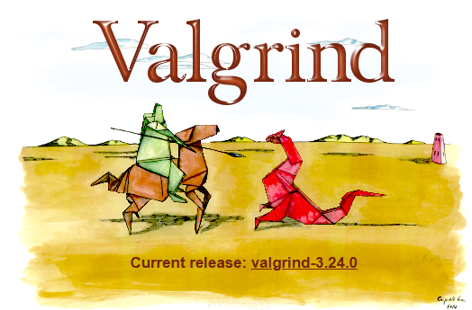

# 探究ECS(一)：缓存命中率
&emsp;&emsp;今年年中的时候，写了玩具版的ecs，但是后面就没有再继续深入。一是没有具体使用场景，二是缺乏对ecs在实践层面上的认识。写这个系列的博客的目的是ECS上发现问题，实践问题，解决问题。本篇就从缓存命中率开始。
<!-- more -->
<figure markdown="1">

</figure>

## 前言
&emsp;&emsp;开发者被ECS吸引大多是从它高性能开始的，看完一些教程后，大家会得出一个结论：ECS的高性能是因为缓存友好。实践出真知，来解释解释什么叫做缓存友好？不像常见算法可以用时间来作为判断标准，缓存友好本身很难用数据展现。不能直击算法的优势要点，有种如鲠在喉的不快。

&emsp;&emsp;分析缓存友好问题，直接监控缓存命中率是不可能的。但是，计算机最不缺的就是环境模拟，下面我选择Valgrind[^1]来做模拟，并做相应实验结果分析。

## 实验设置

## 实验结果

## 后记
&emsp;&emsp;发现使用Valgrind来做缓存命中分析，是偶然一次刷视频网站看到关于缓存命中率的视频[^2]。实际中，数据结构思维面对缓存命中率问题，结果也是挺出人意料的 :>.

## Reference
[^1]: https://valgrind.org/docs/manual/quick-start.html
[^2]: https://www.bilibili.com/video/BV12dz4YoELQ/?spm_id_from=333.880.my_history.page.click&vd_source=b7c2138ea8aa033f5b5f8039de77f0d4
