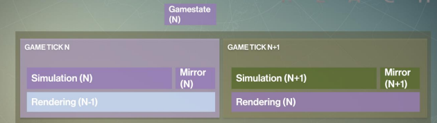
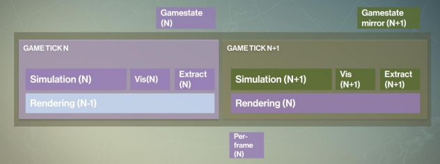
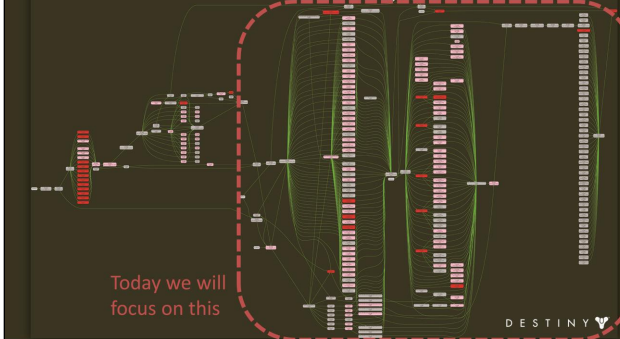
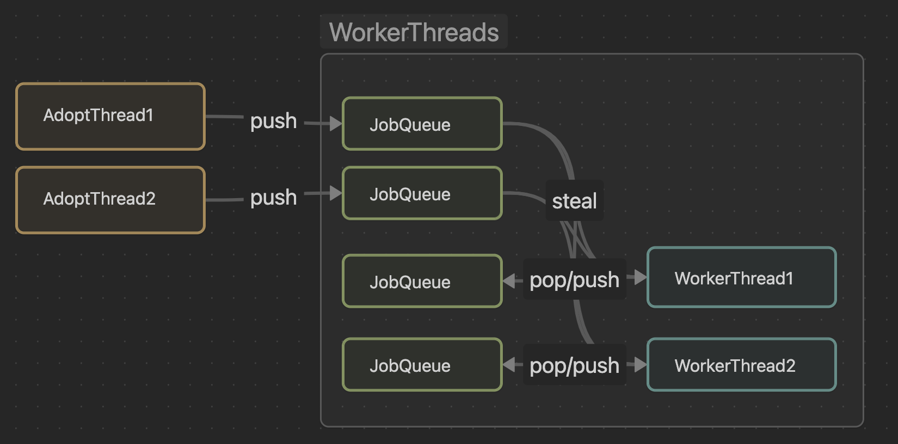
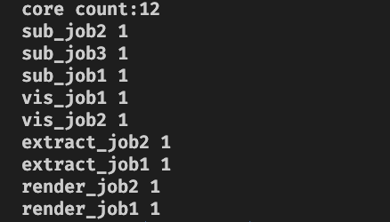

# JobSystem的学习感悟
&emsp;&emsp;从单线程到多线程，再到JobSystem(非unity), 游戏引擎的发展有条清晰的发展路线。本文主要记录了在JobSystem这个设计下的学习和实践。

## 从引擎的心跳开始
&emsp;&emsp;游戏开发中的最常见的函数就是update,它提供游戏中对象在一定时间获得执行程序的能力。但是你是否想过在偌大的游戏引擎中, 大量对象的update是如何进行的?大道至简，老开发选手会说update的“根”来自游戏引擎的主循环。这种说法简单，不过也丢失了一些“细节”。关于这些细节的发展，也影响着引擎代码设计。



&emsp;&emsp;游戏的最初的单线程, Update, Render两个函数交替执行, 代码相对简单。当多核CPU登场，自然地会想着通过多线程来提升引擎性能。于是乎，一些引擎地做法是将Update与Render的逻辑分拆到不同线程，即thread-on-system模式。配合逻辑线程比渲染线程领先1帧的执行方式，将逻辑线程与渲染线程并行执行一帧来获得性能提升。引擎就拥有了多个互相有制约的心跳。

&emsp;&emsp;多线程的引入也带来编程的复杂度。首先就是线程安全, 小bug自不必说, 在大方面上一个重要的转变是游戏状态的线程同步设计。多线程的执行模式会要求引擎要额外保存1帧的游戏状态(额外保存的一帧在渲染线程中使用)。这帧游戏状态的缓存算法当然也有优化空间, 但复杂度就不可避免地提升了。

&emsp;&emsp;当艰难地解决完多线程带来的线程安全问题后，回过头来看，多线程真的解决性能问题吗？答案是有，但不是全部。“一核有难多核围观”可以不太准确地回答这个问题，即线程的负载不平衡导致的性能问题。此时，一帧的时长取决于工作负载大的任务(有渲染与逻辑同步的设计), 此时负载小的线程会处于等待“摸鱼”状态。也就是说按照“System-on-thread”的设计方式存在负载均衡的问题。那么，在多线程的基础上如何充分榨干CPU性能？

<!-- 

 -->

&emsp;&emsp;"System-on-thread"的模式一个存在的问题是分割逻辑粒度大。逻辑复杂不等于执行时间长，但粒度大意味着性能的可控性小。基于这种思维，一种解决方案是将多线程与多线程逻辑分离。在分离的基础上，将逻辑细分形成一个个独立的Job。其中, Job是存在依赖关系的功能单元，JobSystem需要解决Job依赖关系的同时，并行化Job执行; Worker是执行线程，workers从队列中获取并执行Job。JobSystem解决问题了嘛？其实还没有。JobSystem只是分离的逻辑与线程，Job的粒度还是由程序设计者来设置。程序设计者需要充分理解引擎中不同的执行阶段，拆分功能形成Job。但是，好处也很明显，现在的引擎框架程序线程功能与模块无关，充分发挥多线程能力的关键点在于如何Job的拆分。

## JobSystem方法
<!-- more -->
&emsp;&emsp;游戏引擎的一个发展方向就是充分利用多线程能力，Unity和Unreal都有自己的一套多线程框架。多线程是一个复杂的主题，在它基础上再封装更加考验系统开发者的功底。本文主要参考filament的jobsystem设计方式，并在方便理解的基础上对代码做了拆分与封装。
### 核心概念
&emsp;&emsp;JobSystem分为几个部分，工作线程管理，Job API, Job Schedual。将这三部分组合到一个“门面”上，即JobSystem。

&emsp;&emsp;工作线程管理构造出一种经典的多线程工作模式：生产者-消费者模式。在一个线程中存在两个重要组件，工作队列与循环逻辑。工作队列负责接受本线程提交的Job, 而线程循环逻辑在队列中有任务时从队列中获取任务并执行，无任务时处于刮起状态。管理多个这样的线程逻辑即JobSystem多线程部分需要处理的问题。上面的描述存在2个问题。首先，任务只能加入到当前线程的工作队列，岂不是当其他线程跑完其队列任务后就处于围观状态了？当然不是，在这个问题基础上，新增一个从队列取出任务的操作，在源码中称之为“steal”。当无法从当前队列取出任务时，线程循环会尝试从其他线程的队列中获取任务，缓解“围观”这种问题。其次，JobSystem中的多个线程逻辑上属于工作线程，它不和具体任务逻辑产生耦合，那么具体业务线程如何把Job推送到具体工作队列呢？filament给的方案是提供一种“AdoptThread”的概念。AdoptThread可以是程序中的任意线程，它可以被加入到Job System中，使得其也拥有任务队列，但是不拥有Worker Thread的逻辑循环。因此，每个使用Jobsystem接口的线程需要在创建job前，将自身adopt到JobSystem中，以便构造专属任务队列。JobSystem的线程与任务队列模型类似下图:


当然，还有一些技术细节包括任务队列如何实现无锁，steal操作，甚至steal的哪一个线程的策略都是更加细节且值得斟酌的地方，这里源码比文字清晰多了就不再赘述。

&emsp;&emsp;Job API是JobSystem对Job在系统中的功能封装，包括创建、执行、等待、销毁、对象内存管理等。关于Job对象的管理filement采用的是指针+引用计数，即Job创建在一块连续的内存空间上，并在引用计数为0时回收内存空间。执行接口会将Job加入到任务队列中，而等待即阻塞当前线程直到等待的任务完成。其实，在使用方面，filament的JobSystem对外提供的Job对象是裸指针，外部其实不用太关注指针的内存释放。但，私以为可以将裸指针包装一下，用一个handle去引用job会更加用户友好些。

&emsp;&emsp;Job Schedual是JobSystem对工作的调度逻辑。通常，Job是存在依赖关系的，执行存在先后关系，当这些任务多了之后就会形成一张依赖图，只有前置任务完成后，后续任务才能执行。Filament的JobSystem目前支持的是一种类似group间依赖的模式(个人理解，并不一定对): 即在一个group内的Job全部并行执行，不存在先后依赖，而group之间存在先后关系，但是这种先后关系依靠定义任务的Run函数编码先后关系。也就是说，在更加复杂的Job依赖方面，还能有更多的探索空间(我理解上用图来描述依赖关系增加了系统的可用程度，而不是建立在硬编码上)。

### 实现效果
&emsp;&emsp;利用JobSystem去执行简单任务，重在检验依赖和执行顺序（新渲染器还没做完：<）。任务定义如下：
```c++
int test_system_2()
{
    cloud::JobSystem job_sys(std::thread::hardware_concurrency());
    job_sys.adopt();
    std::cout << "core count:" << std::thread::hardware_concurrency()
              << std::endl;
    // simutate task group
    auto simulate_job = job_sys.create(nullptr);
    auto sub_job1 = job_sys.create(
        simulate_job, [](cloud::JobArgs &args) { print_job("sub_job1"); });
    auto sub_job2 = job_sys.create(
        simulate_job, [](cloud::JobArgs &args) { print_job("sub_job2"); });
    auto sub_job3 = job_sys.create(
        sub_job2, [](cloud::JobArgs &args) { print_job("sub_job3"); });
    // visualable update
    auto vis_job = job_sys.create(nullptr);
    auto vis_job1 = job_sys.create(
        vis_job, [](cloud::JobArgs &args) { print_job("vis_job1"); });
    auto vis_job2 = job_sys.create(
        vis_job, [](cloud::JobArgs &args) { print_job("vis_job2"); });

    // extract visual object to render object
    auto extract_job = job_sys.create(nullptr);
    auto extract_job1 = job_sys.create(
        extract_job, [](cloud::JobArgs &args) { print_job("extract_job1"); });
    auto extract_job2 = job_sys.create(
        extract_job, [](cloud::JobArgs &args) { print_job("extract_job2"); });

    // render features
    auto render_job = job_sys.create(nullptr);
    auto render_job1 = job_sys.create(
        render_job, [](cloud::JobArgs &args) { print_job("render_job1"); });
    auto render_job2 = job_sys.create(
        render_job, [](cloud::JobArgs &args) { print_job("render_job2"); });

    job_sys.run(sub_job1);
    job_sys.run(sub_job2);
    job_sys.run(sub_job3);
    job_sys.run_and_wait(simulate_job);
    job_sys.run(vis_job1);
    job_sys.run(vis_job2);
    job_sys.run_and_wait(vis_job);
    job_sys.run(extract_job1);
    job_sys.run(extract_job2);
    job_sys.run_and_wait(extract_job);

    job_sys.run(render_job1);
    job_sys.run(render_job2);
    job_sys.run_and_wait(render_job);

    job_sys.emancipate();
    return 0;
}
```
&emsp;&emsp;代码大概的意思是模拟游戏渲染器的循环包括，模拟、可视检测、提取可视对象数据用于渲染，渲染四个group的任务，每个group里有多个并行执行的任务，四个group应当顺序执行。实验结果如下：


## 总结
&emsp;&emsp;nothing to say. 待完善。

[^1]: https://github.com/google/filament
[^2]: 游戏编程精粹7-1.9 多线程任务和依赖系统

