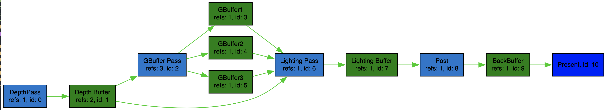

# FrameGraph简析
自己写的D3D12Pipeline相当逻辑混乱，回想起工作时遇到过的FrameGraph。本文主要简单记录了filament的framegraph实现理解。

<!-- more -->
## 简介
&emsp;&emsp;前些日子正在写一个简单的d3d12的渲染程序，渲染Pipline出于简单考虑用Vector来组织Pass。开发到后面就会发现很多Pass之间是有依赖关系。这就意味着，如果想要增删Pass就会牵扯到依赖关系。拔出萝卜带出泥，一旦后续的Pass依赖被删除的Pass，可能就会产生意料之外的效果。那么，换种数据结构？

&emsp;&emsp;最初关注到FrameGraph[^1]是在工作中一次无意翻阅代码时，再见它已经是Cocos在GDC上的演讲展示[^2]。FrameGraph旨在用依赖图的方式来组织渲Pipeline，资源与Pass是图中的节点，资源与Pass之间的依赖关系即图的有向边。通过将Pipeline用图的方式来表达，可以获得许多不错的特性，方便引擎渲染模块的开发与维护。下文介绍的FrameGraph基于Filament开源库[^3]代码，因为它足够简单，对初学者够友好。

## 功能特性

&emsp;&emsp;从功能角度出发，FrameGraph可以实现更加细粒度的GPU资源管理，管理渲染流程更加方便，对非程序工作者来说也更加容易理解渲染流程。

* 使用者可以用有向无环图来展示整个流程，如下图所示。
* 提供GPU资源的申请/释放管理更好的触发时机，当某个资源在某个Pass被使用后，后续Pass没有被使用，则可交还资源给相关的资源分配器。(注：确切地说资源不能马上删除，现代图形API，如D3D12，CPU执行到Pass逻辑后，提交渲染命令。此时，GPU还没有绘制完这一帧，相应的资源不能直接删除)。
* 渲染流程更加容易修改和扩展。由于资源的创建和释放由FrameGraph在运行时Compile阶段决定，因此，当我们想在运行时插入某个Pass，FrameGraph也能很好地更新图信息，自行解决资源问题。

## 代码模块实现
&emsp;&emsp;Filament中有关于FrameGraph的实现，看源代码能够加深理解。我喜欢随手画出类之间的关系，没有UML专业和准确，仅仅展示类之间存在的关系。

&emsp;&emsp;Filament的实现中，将FrameGraph作为一个接口类，类内部主要有下列功能: 持有节点对象，持有依赖图对象，创建Pass节点，读写资源。“持有”类功能主要是从C++对象创建与析构有关。

&emsp;&emsp;在FrameGraph的图模型中有**资源节点**和**Pass节点**两类，他们在图中间隔相连，类似下图。在DependencyGraph类对象中将会保存图中的节点和边，并提供图相关的操作。图元素PassNode，ResourceNode是Node类的子类。Node类持有关于节点的基本信息和引用次数。VirtualResource类是对图模型中资源这一概念的抽象，主要负责在构建图，Compile图过程中对资源概念的抽象，ResourceNode通过handle来保留资源的引用。

&emsp;&emsp;从FrameGraph的使用角度上来说，公开的接口主要下面三个过程:

* 构建阶段：主要类是PassBuilder。PassBuilder类似是FrameGraph部分功能的代理类，包括Create，Read，Write等接口, 函数在调用时也暗含了图节点间的依赖关系。

* Compile阶段: 对构建阶段的图结构进行裁剪，更新结点的依赖关系。依赖图中被裁剪的节点往往是那些孤立的节点串，即被裁剪的节点对渲染结果没有直接影响。依赖关系更新，主要的目的有二：第一，是更新依赖引用计数，因为有可能部分节点是被裁剪掉；第二，注册资源的第一个依赖和最后一个依赖Pass节点，目的在于记录执行阶段出触发资源的创建/回收。

* Execute阶段: 遍历所有经过Compile的节点，创建资源实例，执行Pass逻辑，回收不被需要的资源。

&emsp;&emsp;面对各种各样的Pass需求和Resource类型需求，filament需要对PassNode和Resource进行“扩展”。”扩展“的方式根据数据和操作进行区分，数据通过C++模版类进行扩展，比如FrameGraphPass类的模版参数；操作通过C++callable对象进行扩展, 例如在PassNode的执行逻辑会PassBuilder的AddPass阶段，通过匿名函数对象保存到FrameGraphPass中，当Execute阶段时被Callback。

## 数据结构
todo

## 总结
&emsp;&emsp;FrameGraph本身关注了渲染器本身存在的问题：渲染流程可维护性，GPU资源维护。通过将渲染流程抽象为图模型后，将渲染流程中耦合的逻辑，分解为图的节点和边，并根据图中的节点引用关系，定制运行时需要的数据。图模型优化复杂流水线状的逻辑流程有奇效(想起N年前的tensorflow1.x)。但作为一个非引擎非渲染程序猿，FrameGraph特性给我的感受，最直接的是清晰的逻辑关系和资源管理(因为之前自己实现有点🥬)。实际上，FrameGraph还有很多的特性在这篇笔记中没有提及，比如异步执行Pass逻辑、FrameGraph实际运行性能优势等。

## 引用
[^1]: https://www.gdcvault.com/play/1024612/FrameGraph-Extensible-Rendering-Architecture-in]
[^2]: https://www.gdcvault.com/play/1028845/Open-Source-Game-Development-Summit
[^3]: https://github.com/google/filament

