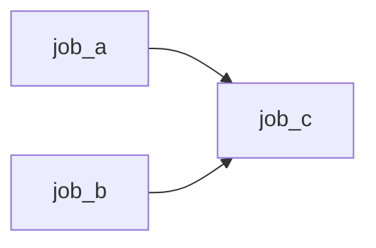
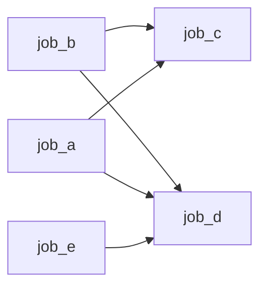

# JobSystem的学习感悟(二)
&emsp;&emsp;上一篇关于jobsystem的感悟, 关注点在于线程和任务。但是还留了一个尾巴：任务间的依赖，以及如何组织任务关系形成所谓的任务图。
<!-- more -->

## 前言

```c++
auto root = js.create_job();
auto job_a = js.create_job(root, ...);
auto job_b = js.create_job(root, ...);
js.runAndWait(root)
auto job_c = js.create_job(nullptr, ...);
```
&emsp;&emsp;关于依赖关系，filament在create_job阶段定义了任务的parent,即一批任务的handle, 配合使用run,wait等函数来形成任务的依赖的作用, 如上图所示。注意runAndWait会阻塞线程，目的是形成等待job_a,job_b已经完成的语义。这样做的一个好处是定义非常清晰。但是，存在两个问题(鄙人短见): 其一，定义依赖关系阶段会阻塞当前线程，其二，并行任务的成组需要程序员有先验知识。第一个很好理解，第二个，比方说现在新增一个job_d, 它和job_c拥有相同的依赖关系外，还依赖一个job_e, 关系如下图所示。代码该怎么写？

```c++
auto root = js.create_job();
auto job_a = js.create_job(root, ...);
auto job_b = js.create_job(root, ...);
auto job_e = js.create_job(root, ...);
js.runAndWait(root)

auto root_2 = js.create_job();
auto job_c = js.create_job(root2, ...);
auto job_d = js.create_job(root2, ...);
js.runAndWait(root_2)

```
&emsp;&emsp;代码变成了这样，一个隐含的点在于，程序员需要先验知识把job_c和job_d归到root_2这个group中。关于job在定义时，只有一个parent的限定，当前任务依赖无法表达为对多个任务的依赖，除非定义一个新的root_x作为handle依赖，可这样又陷入非一个group下无法并行执行的问题。那么，是否有可能在程序员不知道job_c和job_d是可以并行的情况下，程序自动去做job并行执行呢？有的，程序员有的。

### 修改方案 [todo 目前不是很ok]
&emsp;&emsp;针对上面提出的问题，要做的事情有二：其一，把构建任务阶段的wait阻塞函数删除，在系统内部用计数的方式来阻止正在等待中的任务执行。其二，把任务依赖任务的模式修改为任务依赖于计数。实际上，解决方案呼之欲出的一个要点就是用一个计数器来完成依赖构建和等待流程控制，抽象出来的对象, 即Counter。代码如下所示，其中
```c++
Counter counter= Counter.create(js);

JobBuilder builder1(js);
builder1.dispatch("job_a", ...);
builder1.dispatch("job_b", ...);
builder1.dispatch("job_e", ...);
builder1.dispatch_fence_explicitly();
builder1.dispatch("job_c", ...);

counter += builder1.extract_wait_counter();

JobBuilder builder2(js);


JobBuilder builder3(js);
builder3.wait_counter(counter);
builder3.dispatch("job_d", ...);


counter += builder2.extract_wait_counter();


js.spin_wait(builder3.extract_wait_counter().get_entry());
```
&emsp;&emsp;
