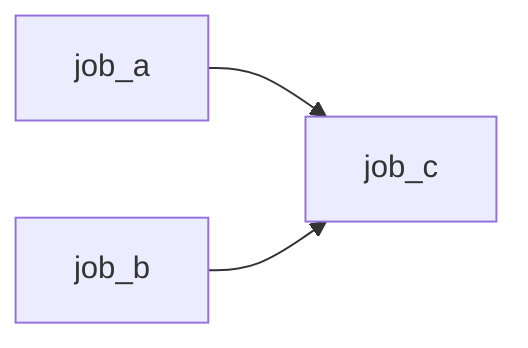
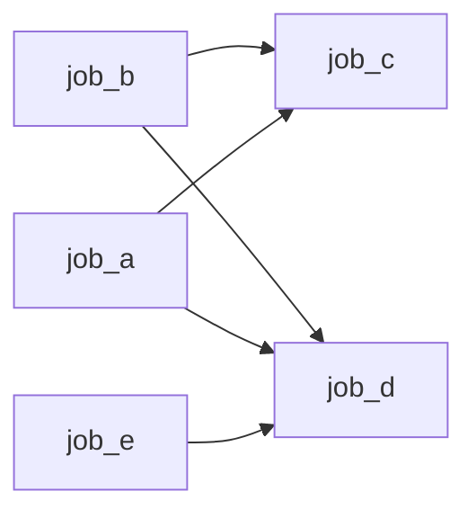

# JobSystem的学习感悟(二)
&emsp;&emsp;上一篇关于jobsystem的感悟, 关注点在于线程和任务。但是还留了一个尾巴：任务间的依赖，以及如何组织任务关系形成所谓的任务图。
<!-- more -->

## 问题来源

```c++
auto root = js.create_job();
auto job_a = js.create_job(root, ...);
auto job_b = js.create_job(root, ...);
js.runAndWait(root)
auto job_c = js.create_job(nullptr, ...);
```
&emsp;&emsp;关于依赖关系，filament在create_job阶段定义了任务的parent,即一批任务的handle, 配合使用run,wait等函数来形成任务的依赖的作用, 如上图所示。注意runAndWait会阻塞线程，目的是形成等待job_a,job_b已经完成的语义。这样做的一个好处是定义非常清晰。但是，存在两个问题(鄙人短见): 其一，定义依赖关系阶段会阻塞当前线程，其二，并行任务的成组需要程序员有先验知识。第一个很好理解，第二个，比方说现在新增一个job_d, 它和job_c拥有相同的依赖关系外，还依赖一个job_e, 关系如下图所示。代码该怎么写？

```c++
auto root = js.create_job();
auto job_a = js.create_job(root, ...);
auto job_b = js.create_job(root, ...);
auto job_e = js.create_job(root, ...);
js.runAndWait(root)

auto root_2 = js.create_job();
auto job_c = js.create_job(root2, ...);
auto job_d = js.create_job(root2, ...);
js.runAndWait(root_2)

```
&emsp;&emsp;代码变成了这样，一个隐含的点在于，程序员需要先验知识把job_c和job_d归到root_2这个group中。关于job在定义时，只有一个parent的限定，当前任务依赖无法表达为对多个任务的依赖，除非定义一个新的root_x作为handle依赖，可这样又陷入非一个group下无法并行执行的问题。那么，是否有可能在程序员不知道job_c和job_d是可以并行的情况下，程序自动去做job并行执行呢？有的，程序员有的。

### 修改方案样例
&emsp;&emsp;思路来源于赛博朋克2077在GDC上的演讲[^1][^2]。我希望能够重新设计接口，能够让使用者更加自由的去创建依赖关系。

&emsp;&emsp;针对上面提出的问题，实际上，解决方案要点就是用一个计数器来完成依赖构建和等待流程控制，抽象出来的对象, 即Counter。要做的事情有二：其一，把构建任务阶段的wait部用计数的方式来阻止正在等待中的任务执行，避免当前线程阻塞。其二，把任务依赖任务的模式修改为任务依赖于计数。代码如下所示，其中Counter类似多线程中的Fence，当Fence计数归0时即可触发等待它的任务。
```c++
    cloud::Counter counter = cloud::Counter::create(js);
    cloud::JobBuilder builder(js);
    builder.dispatch("job_a", ...);
    builder.dispatch("job_b", ...);
    // 提取当前执行流的完成Counter
    counter += builder.extract_wait_counter();

    cloud::JobBuilder builder2(js);
    // 当前builder下的任务要等到counter执行完后才能执行
    builder2.dispatch_wait(counter);
    builder2.dispatch("job_c", ...);

    cloud::JobBuilder builder3(js);
    builder3.dispatch("job_e", ...);
    // 给counter添加新的等待条件
    counter += builder3.extract_wait_counter();

    cloud::JobBuilder builder4(js);
    // 此时如果要等待counter，就是同时等待builder和builder3的任务完成
    builder4.dispatch_wait(counter);
    builder4.dispatch("job_d", ...);

    ...
    // 等待所有任务完成
    js.spin_wait(builder4.extract_wait_counter().get_entry());
    js.spin_wait(builder3.extract_wait_counter().get_entry());
```
### 具体实现
&emsp;&emsp;JobBuilder负责构建一个虚拟的queue, 其中存放的是build创建的任务。Counter作为一个同步条件工具，来实现依赖等待。这是用户接口层面的代码，实际内部构建起了一个基于jobsystem和counter的交互。
[todo]

## Reference
[^1]: [gdc2023 Building NightCity:The Techology of Cyberpunk 2077](https://ubm-twvideo01.s3.amazonaws.com/o1/vault/gdc2023/Slides/Buildingnightcity_Tremblay_Charles.pdf)
[^2]: [gdc2024 The Job System in 'Cyberoybk 2077'](https://media.gdcvault.com/gdc2024/Slides/GDC+slide+presentations/Block_David_TheJobSystem.pdf)
