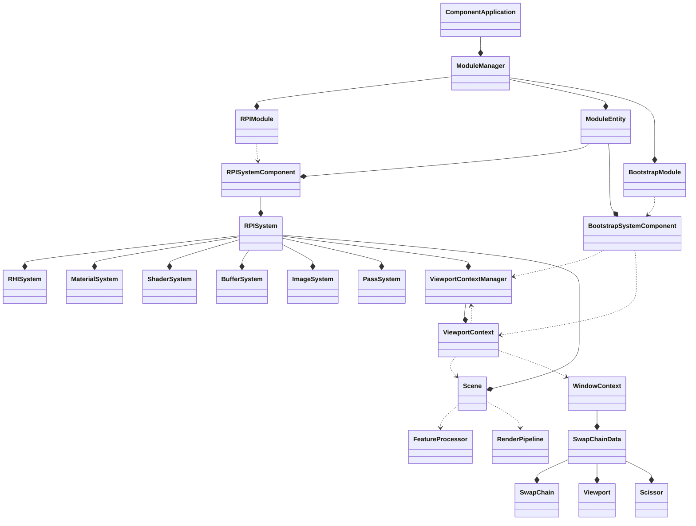
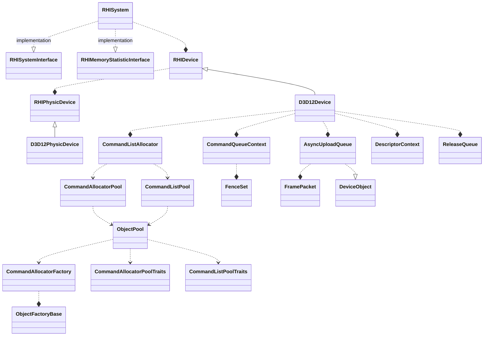
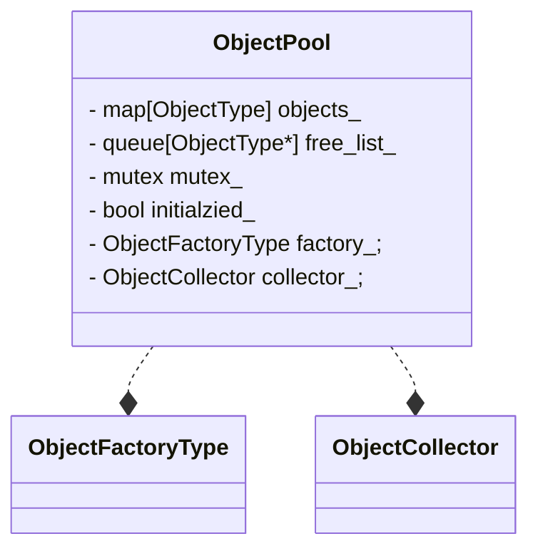

# 类间的关系

<!-- more -->

```mermaid
classDiagram

ViewportContextManager --*ViewportContext
ViewportContext ..> ViewportContextManager
ViewportContext ..> Scene
ViewportContext ..> WindowContext
WindowContext --*SwapChainData
SwapChainData --*SwapChain
SwapChainData --*Viewport
SwapChainData --*Scissor
Scene ..>FeatureProcessor
Scene ..>RenderPipeline

RPISystem --* RHISystem
RPISystem --* MaterialSystem
RPISystem --* ShaderSystem
RPISystem --* BufferSystem
RPISystem --* ImageSystem
RPISystem --* PassSystem
RPISystem --* ViewportContextManager
RPISystem --* Scene
RPISystemComponent --* RPISystem
RPIModule ..> RPISystemComponent
ModuleManager--*RPIModule
ModuleEntity --*RPISystemComponent
ModuleManager--*ModuleEntity
ComponentApplication--*ModuleManager

BootstrapSystemComponent..>ViewportContextManager
BootstrapSystemComponent..>ViewportContext
BootstrapModule..>BootstrapSystemComponent
ModuleManager--*BootstrapModule
ModuleEntity--*BootstrapSystemComponent

class ViewportContext
class Scene
class WindowContext
class ViewportContextManager
class SwapChainData
class FeatureProcessor
class RenderPipeline
class RPISystem
class RHISystem
class MaterialSystem
class ShaderSystem
class BufferSystem
class ImageSystem
class PassSystem


```

## RHISystem类关系

```mermaid
classDiagram
RHISystem ..|> RHISystemInterface: implementation
RHISystem ..|> RHIMemoryStatisticInterface: implementation
RHISystem ..* RHIDevice
RHIDevice..* RHIPhysicDevice
RHIPhysicDevice|>--D3D12PhysicDevice
RHIDevice|>--D3D12Device

D3D12Device..*CommandListAllocator
D3D12Device..*CommandQueueContext
D3D12Device..*AsyncUploadQueue
D3D12Device..* DescriptorContext
D3D12Device..* ReleaseQueue

ObjectFactoryBase
class RHISystemInterface
class RHIMemoryStatisticInterface
class RHISystem

CommandAllocatorFactory..*ObjectFactoryBase
ObjectPool..>CommandAllocatorPoolTraits
ObjectPool..>CommandAllocatorFactory
CommandAllocatorPool..>ObjectPool
CommandListPool..>ObjectPool
ObjectPool..>CommandListPoolTraits
CommandListAllocator..>CommandAllocatorPool
CommandListAllocator..>CommandListPool

CommandQueueContext..*FenceSet
AsyncUploadQueue..*FramePacket
AsyncUploadQueue..|>DeviceObject
```

### ObjectPool的优雅实现

```mermaid

classDiagram

ObjectPool..*ObjectFactoryType
ObjectPool..*ObjectCollector

class ObjectPool{
    - map[ObjectType] objects_
    - queue[ObjectType*] free_list_
    - mutex mutex_
    - bool initialzied_
    - ObjectFactoryType factory_;
    - ObjectCollector collector_;
}
```