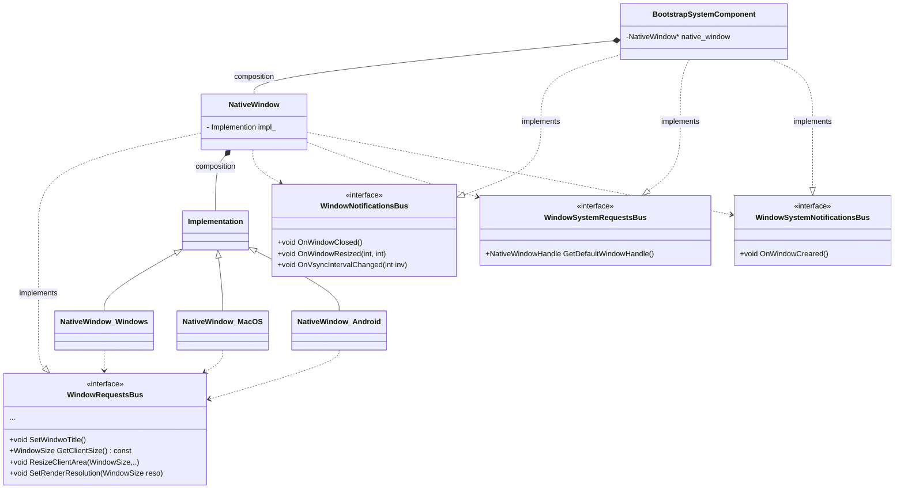

# 分析 O3DE NativeWindow
在开始图形化编程之前，第一步是把窗口画出来。然而平台客户端编程知识的欠缺是制约代码质量的开始。关于客户端窗口编程，网上资料鲜有深入介绍，有的调用现成第三方库，有的简单过程式地编写客户端代码。结果就是当我想扩展这部分功能时，无从下手。这里记录下了学习和开发过程中遇到过问题中的部分有用知识点。

<!-- more -->



## 简介
&emsp;&emsp;学习图形API会遇到画系统窗口的步骤，一般书籍或网上资料会用一个非常简单的实现。由于我之前都是script boy，对于比较偏系统GUI方面的编程经验比较薄弱。每当想去做出一些功能上的扩展，总觉得蹑手蹑脚。于是乎就去源码(o3de[^1])里找找现实产品中的做法, 找找自己没有get到的知识点。

&emsp;&emsp;带着问题看代码是个好习惯。困扰着我的一个问题是: windows窗口消息函数如何绑定成某个类的成员函数？一般在教程里用的都是非成员函数(或类静态函数)，游离在对象之外。而窗口消息处理函数的输入参数除了具体消息外，就是窗口句柄**HWND**。在只知道这些参数的时候，因为消息处理函数的输入只有这些，就不得不通过全局变量/静态变量来获得与HWND关联的自定义窗口对象。这似乎不是一个聪明的办法。另外，窗口部分的代码可以预想到会有很多事件相关的过程，如何去编排它们，使得窗口类能够尽量逻辑清晰。
```c++
// WindowsAPI 消息函数示例
LRESULT CALLBACK WindowCallback(HWND hwnd, UINT message, WPARAM wParam, LPARAM lParam){
    case WM_ACTIVE:
    {
        todo_active(...);
        break;
    }
    case WM_QUIT: {
        todo_quit(...);
        break;
    }
    ...
}
```
## 实现分析
&emsp;&emsp;事实上，游戏引擎的实现远比我考虑的内容要多，不仅仅是我遇到的初级问题，还有诸如跨平台，代码可扩展性等。

### 平台无关，从NativeWindow说起
&emsp;&emsp;NativeWindow类是一个用户定义的窗口类，它一般会拥有一个成员变量来指向操作系统窗口句柄，然后用户可以把围绕窗口的操作都定义在这个类中。一般的教程是这样子的。实际上O3DE的NativeWindow实际上做了两件事情，第一：把有关于操作系统API相关的操作都抽象到了它的一个内部类Implatation中；第二：定义一组窗口相关的函数与Implementation对象互动。真正的平台相关窗口调用函数都被定义在其他的类中，并继承Implementation类。运行时，NativeWindow对象中会初始化一个Implatation对象, 这个对象会因为平台而实例化。

### 窗口句柄与自定义窗口类对象绑定
&emsp;&emsp;NativeWindow既然做把平台无关这件事做了，那么带着我的问题，继续着眼NativeWindow_Windows.我的问题主要关注到了这个类的三个位置。
* 消息函数。NativeWindow_Windows这个类定义了一个成员函数作为Windows的消息函数。
```c++
static LRESULT CALLBACK NativeWindow_Windows::WindowCallback(HWND hwnd, UINT message, WPARAM wParam, LPARAM lParam);
```
它在WindowsAPI的填充**WNDCLASSEX**结构体过程中， 以函数地址作为**lpfnWndProc**的参数注册到窗口类型中。这个过程与非成员函数的使用方法一样。
* 绑定窗口句柄与NativeWindow_Windows对象。WindowsAPI当然给予了使用者系统接口来实现这个功能，即 **SetWindowLongPtr**。
```c++
// 函数签名
// Changes an attribute of the specified window.
LONG_PTR SetWindowLongPtrA(
  [in] HWND     hWnd,
  [in] int      nIndex,
  [in] LONG_PTR dwNewLong
);

// 实际使用
SetWindowLongPtr(win32_handle_, GWLP_USERDATA, reinterpret_cast<LONG_PTR>(this));
```
SetWindowLongPtr在上面的例子里把this(NativeWindow_Windows的对象)存储到了句柄为win32_handle_的窗口用户数据(GWLP_USERDATA指定)中。
* 获取与HWND绑定的自定义类对象。WindowAPI也提供了一个API函数能够获取到上一步被绑定的指针，**GetWindowLongPtr**。

```c++
LRESULT CALLBACK NativeWindow_Windows::WindowCallback(HWND hwnd, UINT message, WPARAM wParam, LPARAM lParam){
    // 获取窗口对象
    NativeWindow_Windows *native_window = reinterpret_cast<NativeWindow_Windows *>(GetWindowLongPtr(hwnd, GWLP_USERDATA));
    case WM_ACTIVE:
    {
        native_window->todo_active(...);
        break;
    }
    case WM_QUIT: {
        native_window->todo_quit(...);
        break;
    }
    ...
}

```
函数调用相当直白，它在窗口函数中用于获取窗口对象，然后我们就可以愉快地调用窗口类的成员函数来处理窗口消息。

&emsp;&emsp;复盘**SetWindowLongPtr** && **GetWindowLongPtr**的功能，它们给予了我们一种API级别的方法让窗口句柄获得窗口类。试想如果自己去实现这个过程，需要定义容器，管理容器，从容器中查找等操作，虽然也不会过于复杂，但一定没有直接调用函数来的方便。

### 消息处理的设计
&emsp;&emsp;消息的处理函数主要分为，窗口生命周期、用户输入。在实际代码中消息可以与“委托”结合起来，这样一来可以将消息与操作系统平台分开，也可以把具体的处理逻辑与消息解耦。O3DE中，将消息的注册和分发都使用EBus来实现。EBus类似‘委托’可以注册、消息分发、也可以从一个EBus中获取返回值, 不同的是，EBus具体的多个事件接口是一个类，处理函数需要继承EBus。

&emsp;&emsp;O3DE的实现还考虑了消息的使用场景，具体来说，对于需要改变类状态的消息，使用Request来命名，对于类自身状态变化后需要广播的场景，使用Notification，也即对自身提供的外部可用接口使用EBus暴露出来，而对于自身需要依赖的接口，通过EBus来告知和调用。比如在NativeWindow的设计中，NativeWindow继承了**WindowRequestsBus**, 而内部NativeWindow通过**WindowNotificationsBus**,**WindowsRequestsBus**,**WindowSystemNotification**的广播或单播来间接通知其他模块。


## 引用
[^1]: https://github.com/o3de/o3de