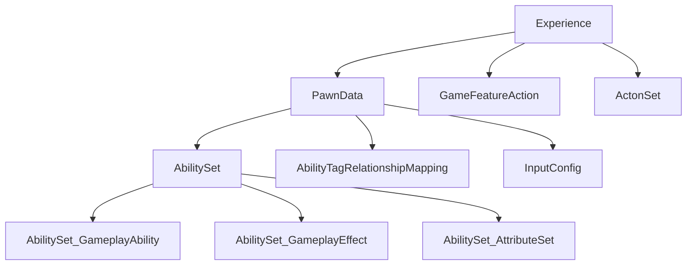

# 从数据角度学UE-Lyra

&emsp;&emsp;看任何代码如果觉得看不懂，从配置开始绝对是一个好的切入点。学习UE Lyra，我尝试从数据的角度去发掘功能实现，效果也挺不错。这里，我尝试从数据的角度去学习UE，分析Lyra的实现。
<!-- more -->

## 数据驱动
|名称|类名| 功能|
|---|---|---|
|Experience|LyraExperienceDefinition|“体验”的数据载体|
|PawnData|LyraPawnData|可控制体的配置，包括Pawn类型，技能，基础输入映射|

### Experience数据化哪些内容？为此Lyra做了什么？
&emsp;&emsp;在游戏开发过程中，数据的"权力"通常把握在策划的手中。策划同学需要去调整数据，来实现一些玩法，调整游戏数值等等。Experience数据化了什么内容？

&emsp;&emsp;Experience中包含了几个方面的数据。在输入方面，引用InputConfig数据。InputConfig中有一些输入行为和GameplayTag。在角色方面，它指定了Pawn的默认蓝图。最后一个就是指定需要加载的Gameplay Feature。

&emsp;&emsp;Experience持有数据，游戏中的逻辑就是对Experience数据的加载和对象逻辑初始化（颇有DOD面向数据编程的味道）。加载Experience发生在GameMode对象InitGame函数中，整个加载的过程配合GameState的ExperienceManagerComponent来实现。而对象逻辑初始化则基本上发生在Experience加载完成后的事件回调中OnExperienceLoad中。回调函数创建了Pawn,配置了Pawn的InputConfig。基本上是对应数据内容。

&emsp;&emsp;注意在Experience加载完成之前也会创建Pawn，但是由于没有会发现没有Pawn类型（神奇的Lyra在WorldSetting中没有设定默认的Pawn类型），也没办法生成Pawn。也就是说具体的Pawn相关逻辑都延后到Experience加载完成后。

