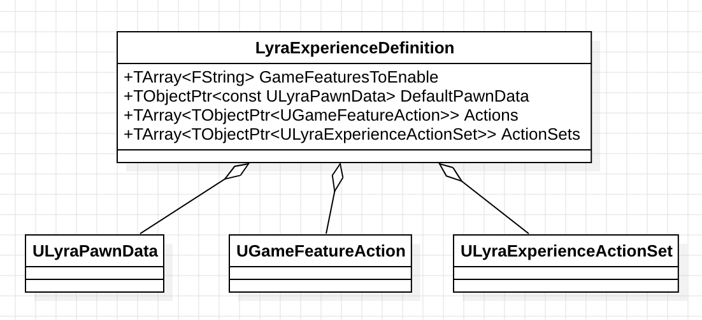
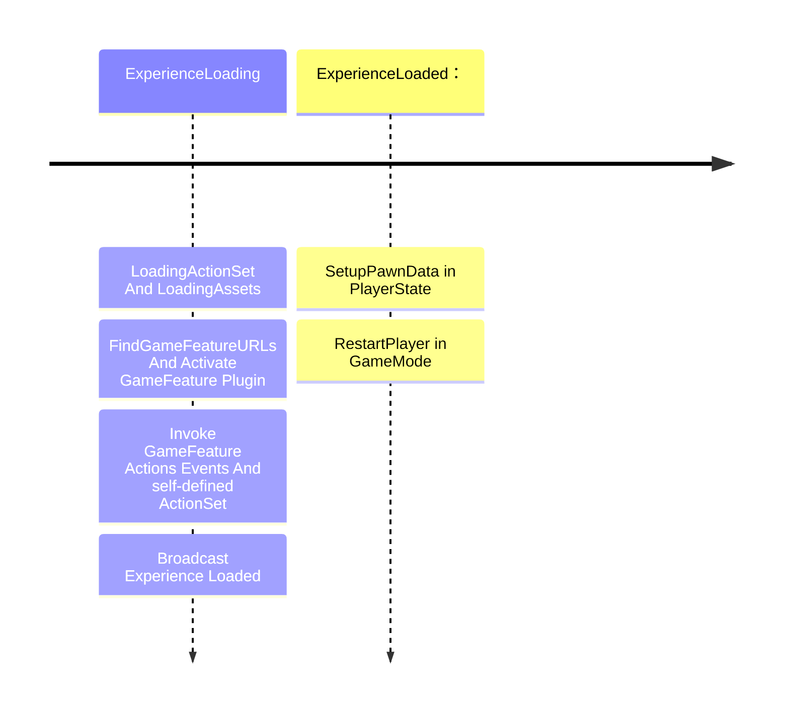
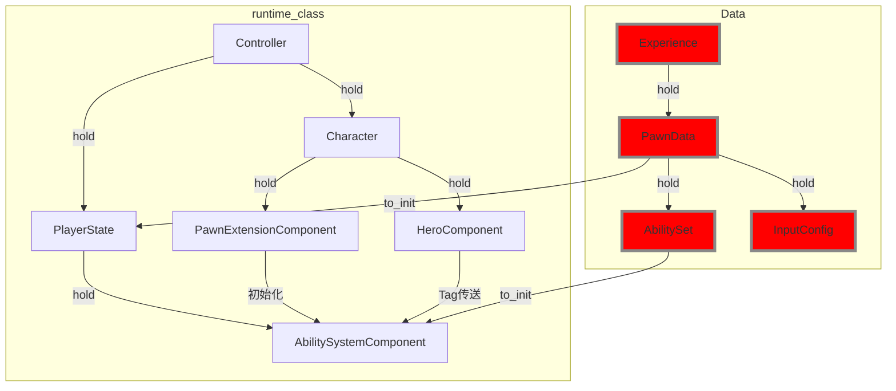

# 从数据角度看UE-Lyra (一)

&emsp;&emsp;曾经，我在看项目的一些疑难代码，并感到无从下手时，找到对应的数据配置表总能给我一个缝隙去看到代码的运行原理。秉持这个trick, 我尝试去深入UE-lyra的源代码，感受下这个“著名”的UE新手村Boss。一切就从Experience开始吧。
<!-- more -->

todo title

### Experience数据化哪些内容？为此Lyra做了什么？
&emsp;&emsp;在游戏开发过程中，数据的"权力"通常把握在策划的手中。策划同学需要去调整数据，来实现一些玩法，调整游戏数值等等。Experience数据化了什么内容？游戏的初始化阶段，我将他们分为两个阶段。第一个阶段是载入Experience，第二是在后Experience之后的操作，两者的分界点是OnExperienceLoaded函数。每一个阶段都有类似状态机模式来实现功能，具体过程可以参考LyraExperienceManagerComponent和LyraPlayerState。

#### 开始之前：Experience 持有的数据
&emsp;&emsp;Experience中包含了几个方面的数据。GameFeaturesToEnable代表需要载入的GameFeature插件；DefaultPawnData代表关于Pawn相关的一些配置，包括Pawn的类型，输入等；Actions表示在Experience加载过程中的FeatureActions，比如可以加载UI，加载Component等；至于ActionsSets，todo;

&emsp;&emsp;Experience是一个“体验”的整体，实际上不仅仅是纯数据，还有功能、UI、美术资产等都有被记录。在我经历过的游戏项目中，数据包含程序配置和策划配置。Experience像是两者的结合。

#### 阶段1: Experience的载入
&emsp;&emsp;
游戏中的初始化逻辑就是对Experience数据的加载和准备对象状态。（颇有DOD面向数据编程的味道）。加载Experience发生在GameMode对象InitGame函数中，整个加载的过程配合GameState的ExperienceManagerComponent来实现。而对象逻辑初始化则基本上发生在Experience加载完成后的事件回调中OnExperienceLoad中。

&emsp;&emsp;注意在Experience加载完成之前也会创建Pawn，但是由于没有会发现没有Pawn类型（神奇的Lyra在WorldSetting中没有设定默认的Pawn类型），也没办法生成Pawn。也就是说具体的Pawn相关逻辑都延后到Experience加载完成后。

#### 阶段2：ExperienceLoaded之后

&emsp;&emsp;

## 技能类间关系

