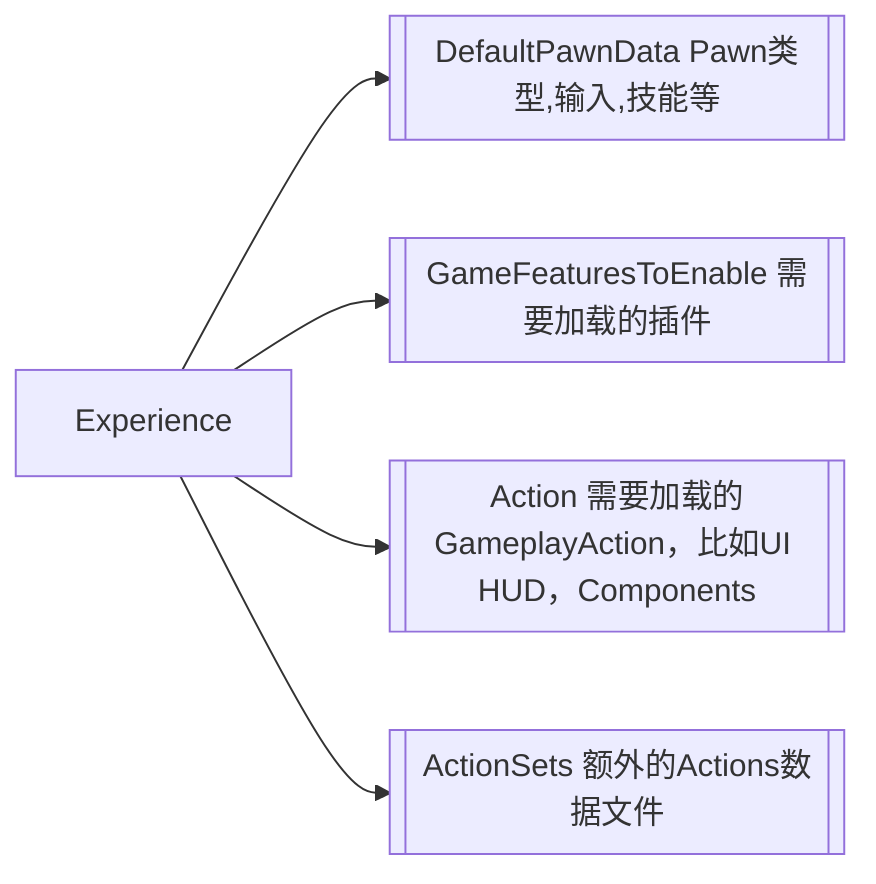

# Learn UE (一)｜从Experinece数据看Lyra

&emsp;&emsp;曾经，我在看项目的一些疑难代码，并感到无从下手时，找到对应的数据配置表总能给我一个缝隙去看到代码的运行原理。秉持这个trick, 我尝试去深入UE-lyra的源代码，感受下这个“著名”的UE新手村Boss。在本小节中，在此记录关于Experience的基础功能。
<!-- more -->

### Experience数据化哪些内容？为此Lyra做了什么？

&emsp;&emsp;Experience属于是Lyra比较基础的设施，承载了Lyra中关于游戏的数据内容。Experience数据化了什么内容？游戏流程是如何加载Exprience？摸清楚这些可以建立起Lyra框架的概念。贯彻Experience在游戏运行时的功能，有3个部分是值得一看的：

1. Experience的加载过程
2. Experience中包含了哪些数据
3. Experience中包含的数据个字的作用

&emsp;&emsp;第一、二点是相对具体的，它们会在本章节描述记录。至于第三点，它是一个范围较宽的问题，适合在后续章节中展开。所以，本章节的主要任务就是描述清楚Experience如何加载，以及Experience中大概包含的数据类型。

#### 阶段1: Experience的载入
&emsp;&emsp;当点击“play”按钮，Experience就随之开始发挥作用。我将他们分为两个阶段。第一个阶段是载入Experience，第二是在后Experience之后的操作，两者的分界点是OnExperienceLoaded函数。每一个阶段都有类似状态机模式来实现具体状态下的功能，具体过程可以参考LyraExperienceManagerComponent和LyraPlayerState。

&emsp;&emsp;戏中的初始化逻辑是对Experience数据的加载和准备对象状态。（颇有DOD面向数据编程的味道）。第一阶段起始于GameMode对象InitGame函数中，并在LyraExperienceManagerComponent中维护存在线性的加载过程。

1. 搜索，加载Experience中的Asset
2. 收集，加载GameFeatures
3. 执行GameFeatureActions的生命周期函数

当线性加载过程完成后，触发OnExperienceLoaded委托，准备进入下一阶段。

#### 阶段2: 应用Experience
&emsp;&emsp;事实上，进入阶段二也主要做了两件事情。首先是创建Pawn。但是怎么创建呢？Pawn的类型是Experience中定义的；第二，输入绑定。如果从驾驶机器人的比喻而言，相当于是创建了机器人，并且预设好了驾驶员能做的操作。但实际上在背后，GameFeatures中定义了能力，按需加载。

## 后记
&emsp;&emsp;Experience把数据集中在了AssetData中，做法无非是集中管理配置，但是背后的动机是值得思考的。面向对象喜欢把经常“变化”的概念抽象出来，给予“变化”在代码层面上的自由扩展。而Experience定义了“体验”，把所谓的体验定义出来扩展出各种变化的体验，确实比较精彩。但是越是抽象的概念，变化的范围也像对更大(函数空间很大)，所以需要在Experience中各种子数据上做更多的分析才能领略其做法是否可靠。
