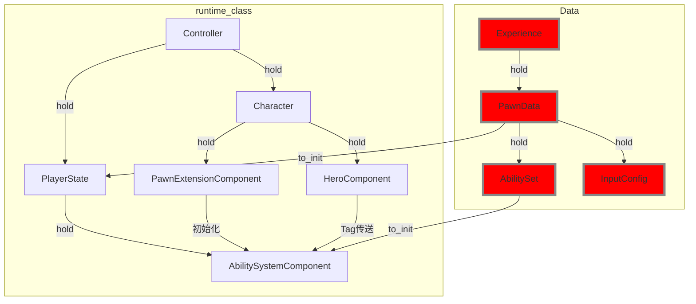

## 技能类间关系

```mermaid
graph TD

subgraph runtime_class
Controller--hold-->PlayerState
PlayerState--hold-->AbilitySystemComponent
Character--hold-->HeroComponent
Character--hold-->PawnExtensionComponent
PawnExtensionComponent--初始化-->AbilitySystemComponent
HeroComponent--Tag传送-->AbilitySystemComponent
Controller--hold-->Character
end

subgraph Data
Experience--hold-->PawnData
PawnData--hold-->AbilitySet
PawnData--hold-->InputConfig
end

AbilitySet--to_init-->AbilitySystemComponent
PawnData--to_init-->PlayerState


style AbilitySet fill:#f00, stroke:#888,stroke-width:4px
style PawnData fill:#f00, stroke:#888,stroke-width:4px
style Experience fill:#f00, stroke:#888,stroke-width:4px
style InputConfig fill:#f00, stroke:#888,stroke-width:4px
```